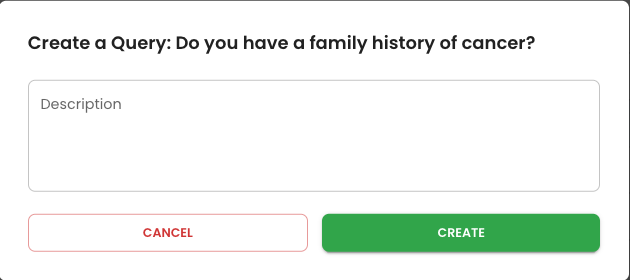
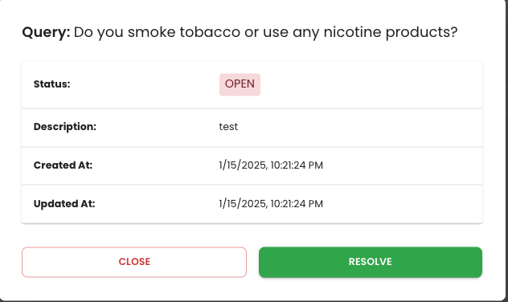
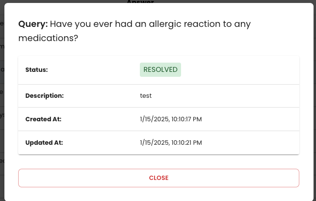

# Vial Query Management Application

## Introduction

Hello! I'm Hanna, and this is my Vial Query Management Application.
The backend is built with **Node.js**, while the frontend uses **React** and **TypeScript**.






## Running the project Locally

### Running FE

- Navigate to the `frontend` folder and run `npm start` and see that it's running in development mode.Open [http://localhost:3000](http://localhost:3000) to view it in the browser.

### Running BE

- copy the .env.example file into a .env file
- `docker-compose build`
- `docker-compose up`
- `npm run migrate`
- `npm run seed`
- if you view your database, you should be able to see a populated form data table
- running the following in your terminal will perform a GET request to fetch the form data

```bash
curl --location 'http://127.0.0.1:8080/form-data' --header 'Content-Type: application/json'
```

## Backend Overview

### Database

- In the `schema.prisma` file, I introduced a new model called `Query` with the following fields:
  - **`id`** (UUID)
  - **`title`** (String, required)
  - **`description`** (String, optional)
  - **`createdAt`** (Date, required.)
  - **`updatedAt`** (Date, required.)
  - **`status`** (String, possible values (OPEN, RESOLVED)
  - **`formDataId`** the relational foreign key id of the formData
  - **`FormData`**
  - A one-to-many relationship was created between `FormData` and `Query`, allowing each form data entry to associate with multiple queries.  
    _(This approach is more future-proof in case additional queries need to be associated with a single form data entry.)_

### Routes

- In the `src/routes` directory, I created the following files:
  1. **`form_data.ts`**: Handles RESTful API endpoints related to form data.
  2. **`queries.ts`**: Manages RESTful API endpoints for queries.

## Frontend Overview

### Project Setup

- The frontend is a React application with its own configuration files for easier dependency management:
  - `package.json`
  - `package-lock.json`
  - `tsconfig.json`

### Components

- **`FormDataComponent`**: Manages interactions with form data.
- **`GenerateTableColumns`**: Dynamically generates column configurations for tables.
- **`TextDisplayCell`**: Handles text display within table cells.
- **Modals**: Includes two modal components for new and existing queries.

### Services

- **API Management**:
  - **`api.ts`**: A central file that manages backend API connections.
- **Custom Hooks**:
  - **`useFormDataApi`**: Manages API calls related to form data.
  - **`useQueriesApi`**: Handles API calls for queries.

### API Documentation

#### Endpoints

1. **GET `/form-data`**

   - **Description**: Retrieves all form data along with their related queries.
   - **Response**: Returns an array of form data objects with associated queries.

2. **POST `/queries`**

   - **Description**: Creates a new query.
   - **Request Body**:
     ```json
     {
       "title": "string",
       "description": "string",
       "formDataId": "string"
     }
     ```
   - **Response**: Returns the created query object.

3. **PUT `/queries/:id`**

   - **Description**: Updates an existing query by its ID.
   - **Path Parameter**:
     - `id` (string): The ID of the query to update.
   - **Request Body**:
     ```json
     {
       "title": "string",
       "description": "string",
       "formDataId": "string",
       "status": "string"
     }
     ```
   - **Response**: Returns the updated query object.

4. **DELETE `/queries/:id`**
   - **Description**: Deletes a query by its ID.
   - **Path Parameter**:
     - `id` (string): The ID of the query to delete.
   - **Response**: Returns a success message or confirmation of deletion.

## Future Improvements

- **Monitoring and Analytics**

  - Integrate tools such as DataDog or Looker to monitor application performance, track server-client interactions, and analyze database activity.

- **Testing Enhancements**

  - Implement **Unit Testing** to verify the functionality of individual components and functions.
  - Add **End-to-End (E2E) Testing** to ensure seamless workflows and robust user interactions.

  - **Global State Management**

  - Implement a global state management solution such as Redux or the Context API. Currently, state is managed locally and passed between components, which can lead to inconsistencies and make the application harder to maintain. Adopting a global state management approach will enhance consistency, improve scalability, and simplify data flow across the application.

- **Future Additions**

  - Add a functional Delete button to remove queries associated with form data.
  - Provide notifications (via email or text) for users when their queries are resolved.
  - Leverage the one-to-many relationship to enable multiple queries per question and display them effectively.
